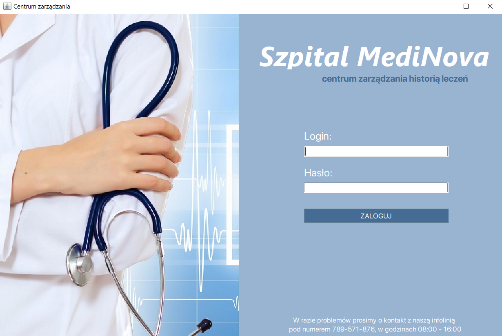

# SzpitalNetBeans :hospital: :page_facing_up:
Repozytorium zawiera aplikację, która ma służyć przeglądaniu historii medycznej pacjentów jak również dodawaniu nowych pacjentów przez lekarzy w szpitalu. Aplikacja posiada możliwość logowania się z poziomu lekarza.  
Stworzone w celu zaliczenia przedmiotu.

# Informacje dodatkowe
***  
__Narzędzia:__ Java, SQL   
__Środowisko:__  Apache NetBeans IDE 12.6, Microsoft SQL Server Meanagment Studio   
__Data zaliczenia:__ 27.05.2022     
***

__Autorzy:__  
Kacper Jach   
Justyna Krotoszyńska   
Kajetan Warmbier   
# Ekrany aplikacji
1. Ekran logowania - frame umożlwiający zalogowanie się lekarza do systemu.
 
2. Ekran główny - zawiera informacje o aktualnie zalogowanym użytkowniku oraz przejścia do innych funkcjonalności.

3. Ekran wyszukiwania - pozwala wyszukiwać pacjentów z całej bazy pacjentów za pomocą numeru pesel lub jego fragmentu.

4. Ekran dodawania nowego pacjenta - umożliwia dodawanie nowego pacjenta do bazy. Sprawdza również czy wpisany pesel nie znajduje się już w bazie, jeżeli istnieje, to zwraca odpowiedni komunikat i uniemożliwia dodanie.

