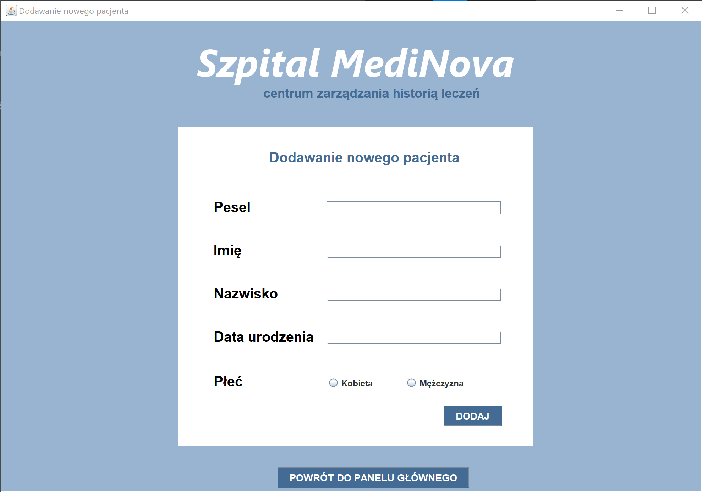

# SzpitalNetBeans :hospital: :page_facing_up:
Repozytorium zawiera aplikację, która ma słuzyć przeglądani histotii pacjentów oraz lekarzy w szpitalu.   
Stworzone w celu zaliczenia przedmiotu.

# Informacje dodatkowe
***  
__Narzędzia:__ Java, SQL   
__Środowisko:__  Apache NetBeans IDE 12.6, Microsoft SQL Server Meanagment Studio   
__Data zaliczenia:__ 27.05.2022     
***

__Autorzy:__  
Kacper Jach   
Justyna Krotoszyńska   
Kajetan Warmbier   
# Ekrany aplikacji
 

